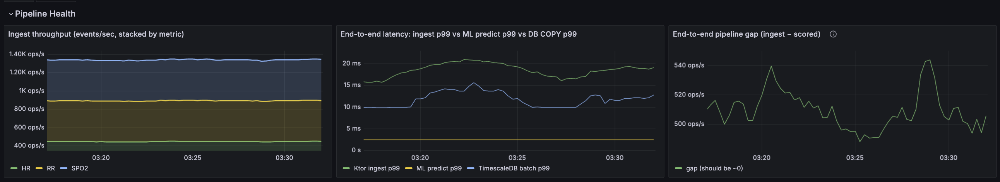
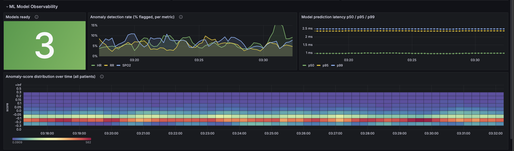
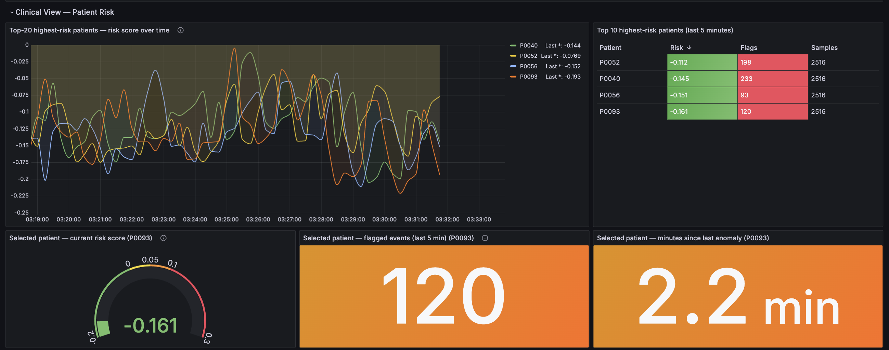
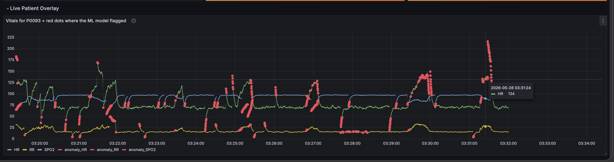

# Clinical Telemetry & Patient Risk Platform

A real-time data pipeline for ICU vital-sign monitoring. The system ingests continuous bedside-monitor readings (heart rate, blood-oxygen saturation, respiratory rate), uses an unsupervised machine-learning model to distinguish real readings from sensor glitches, persists everything to a time-series database, and exposes live visibility into the pipeline and the model via Grafana.

**At a glance:** 100 simulated patients, ~1,500 events/sec sustained throughput, sub-50 ms end-to-end latency, no data loss.


## Background

A modern intensive-care unit produces continuous data from every bedside monitor. Heart rate, blood-oxygen saturation (SpO₂), and respiratory rate are sampled several times per second per patient. A 30-bed unit can generate hundreds of thousands of measurements per minute.

Two problems shape the design of any system that handles this data:

1. **Throughput and storage.** Generic relational databases degrade under sustained high-frequency inserts that compete with dashboard queries on the same table. A time-series database with time-based partitioning, compression, and pre-computed rollups is required.

2. **Sensor noise.** Bedside monitors produce frequent false readings: probes slip, cables disconnect, leads pick up electrical interference. Each glitch is a single impossible value. If those reach clinicians as alarms, the false-positive rate becomes so high that real alarms are routinely ignored. This is called alarm fatigue, and it is a documented patient-safety problem. Sensor artifacts must be filtered before they become alarms, by a system whose behavior is observable and tunable.

This project addresses both problems through a four-stage pipeline that prioritizes throughput, observability, and explicit failure handling at every layer.

## Architecture Overview

The pipeline consists of 4 stages connected by Kafka topics, plus an observability layer scraped from all three application services:

- **Stage 1: Ingest.** A Kotlin/Ktor HTTP service receives readings and produces them to the Kafka topic `telemetry.raw` with strict durability settings.
- **Stage 2: ML scoring.** A Python service consumes `telemetry.raw`, scores each reading with a per-metric IsolationForest, and republishes the result to `telemetry.scored`.
- **Stage 3: Persistence.** A Kotlin worker consumes `telemetry.scored` and batch-writes every event (clean and flagged) to TimescaleDB via PostgreSQL `COPY`.
- **Stage 4: Observability.** Prometheus scrapes each service every 5 seconds. Grafana renders four rows of dashboard panels backed by both Prometheus (pipeline metrics) and TimescaleDB (clinical data).

Infrastructure (Kafka, TimescaleDB, Prometheus, Grafana) runs in Docker via Docker Compose. The three application services (ingest, ML detector, worker) run on the host for fast iteration.

## Data Flow

```
Simulated Patient (HR / SpO2 / RR sample)
  → [Ingest]        HTTP POST /ingest, Kafka producer with acks=all
  → [Kafka raw]     telemetry.raw, 16 partitions, keyed by patientId
  → [ML Detector]   IsolationForest feature extraction + predict
  → [Kafka scored]  telemetry.scored with flagged, anomalyScore, reason
  → [Worker]        Batched COPY into TimescaleDB
  → [TimescaleDB]   Hypertable partitioned by time + patient_id
  → [Grafana]       Live dashboards (PromQL + raw SQL)
```

## Glossary

Brief definitions for terms used throughout this document.

- **Kafka:** A distributed log that holds messages in order. Producers append messages; consumers read them. Used here to decouple services and provide durability.
- **Topic / Partition:** A topic is a named stream of messages in Kafka. A topic is split into partitions, each holding an ordered subsequence of the messages. Partitioning enables parallel consumption.
- **TimescaleDB:** PostgreSQL with an extension for time-series workloads. Adds automatic time-based partitioning and columnar compression on top of standard PostgreSQL.
- **Hypertable:** TimescaleDB's term for a logical table that is internally partitioned into many smaller physical tables (called chunks) based on a time column.
- **IsolationForest:** An unsupervised anomaly-detection algorithm from scikit-learn. It identifies points that are statistically uncommon without requiring labeled training data.
- **Unsupervised model:** A model trained without labeled examples. The model learns the structure of the data and identifies outliers, rather than being told in advance what is "normal" or "anomalous."
- **Prometheus:** A metrics database that periodically pulls numerical measurements from running services and stores them.
- **Grafana:** A visualization tool that renders dashboards on top of data sources such as Prometheus or PostgreSQL.
- **Ktor:** A Kotlin framework for building asynchronous HTTP services.
- **Coroutine:** A unit of work that can pause and resume without blocking a thread, allowing a small number of OS threads to handle thousands of in-flight operations.
- **HikariCP:** A JDBC connection pool. Manages a fixed set of database connections shared by application code.
- **COPY:** A PostgreSQL protocol command that streams a tab-separated block of rows directly into a table. Significantly faster than per-row `INSERT` for large batches.

## Stage-by-Stage Architecture

### Stage 1: Ingest

**Purpose:** Accept incoming readings over HTTP, validate them, and produce them to Kafka with durability guarantees.

**Key Features:**

- **Non-blocking I/O:** Each HTTP request is handled by a Kotlin coroutine running on Netty. The service supports thousands of concurrent connections on a small number of OS threads.
- **Durable producer configuration:** `acks=all` ensures every message is acknowledged by all in-sync replicas. `enable.idempotence=true` deduplicates retried sends. Retries are unbounded on transient failures.
- **Partition routing by patient ID:** The `patientId` field is used as the Kafka message key. Messages with the same key always go to the same partition, preserving per-patient ordering across both Kafka hops while allowing horizontal consumer parallelism.
- **Producer-side batching:** A 5 ms linger window coalesces messages into larger Kafka requests. `zstd` compression reduces network and disk footprint.
- **Prometheus instrumentation:** Counters and histograms expose per-metric throughput and end-to-end ingest latency.

**Output:** Messages on `telemetry.raw` with payload `{patientId, metric, value, timestamp, deviceId}`.

### Stage 2: Kafka (transport and buffer)

**Purpose:** Decouple every stage of the pipeline and provide durable buffering.

**Key Features:**

- **KRaft mode:** Single-broker setup without ZooKeeper. 16 partitions each on `telemetry.raw` and `telemetry.scored`.
- **Durability:** Every reading is written to the Kafka log on disk before the ingest service returns HTTP 200 to the client.
- **Backpressure absorption:** If the ML detector or the worker slows down, Kafka holds the backlog in its log. Upstream stages are not blocked by a slow downstream consumer.
- **24-hour retention** for local development. Configurable via `KAFKA_LOG_RETENTION_HOURS` in `docker-compose.yml`.

### Stage 3: ML Detector

**Purpose:** Classify every reading as either a sensor artifact (flagged) or a clean signal (passed through), in real time, without labeled training data.

**Key Features:**

- **Pre-trained model:** `scikit-learn` `IsolationForest`, one model per metric (HR, SpO₂, RR), pooled across all patients during training.
- **5-D feature vector per sample:** raw value, single-sample jump magnitude, local z-score against a 30-second window, local standard deviation, and distance from the population baseline.
- **Rolling history (per patient, per metric):** A deque of the most recent 150 samples used only for feature extraction, not for training.
- **Warmup and refit:** Each model becomes active after seeing 1,000 events for its metric (approximately 7 seconds at full throughput). Each model refits every 5,000 events on the most recent 1,000 feature vectors.
- **Confidence calibration:** Anomaly scores are sign-flipped from `decision_function` output so that larger values indicate higher anomaly.
- **Full Prometheus surface:** Per-metric throughput counters, flagged counters, prediction-latency histograms, anomaly-score distribution histograms, model-ready gauges, refit counters, and training-buffer-size gauges.

**Output:** Messages on `telemetry.scored` with the original payload plus three new fields: `flagged: bool`, `anomalyScore: float`, `reason: string`.

**Example:**

```python
from detector import extract_features, fit_model

features = extract_features(value=205.3, metric="HR", state=patient_state)
# Returns: np.array([205.3, 87.4, 6.81, 5.2, 5.21])

prediction = model.predict(features.reshape(1, -1))[0]
score = -model.decision_function(features.reshape(1, -1))[0]
# Returns: -1 (anomaly), score=0.34
```

### Stage 4: Worker (Persistence)

**Purpose:** Consume scored events from Kafka and batch-write them into TimescaleDB.

**Key Features:**

- **Batched COPY writes:** Up to 1,000 rows per batch streamed via `COPY ... FROM STDIN WITH (FORMAT text)`. Approximately 8 to 10 times faster than batched `INSERT` for batches this size.
- **All events persisted:** Both `flagged=TRUE` and `flagged=FALSE` rows are written. Distinguishing them is the responsibility of the schema (`flagged` column), not the worker. This is required by the anomaly-marker overlay panel.
- **JDBC timeouts:** `socketTimeout=30s` and `tcpKeepAlive=true` prevent indefinite blocking on a half-broken database connection.
- **HikariCP hardening:** `leakDetectionThreshold=60s`, `keepaliveTime=30s`, and `validationTimeout=3s`.
- **Retry logic:** Each COPY batch is retried up to 3 times with exponential backoff before being reported as a permanent failure.
- **No commit on failure:** If a batch fails permanently, the worker does not commit the Kafka offset. Kafka redelivers the batch on the next poll, eliminating silent data loss.
- **Structured logging:** A configured `logback.xml` ensures every batch, retry, and failure is visible in stdout with a timestamp.

**Output:** Rows in the `telemetry` hypertable with columns `time, patient_id, metric, value, device_id, z_score, window_mean, window_std, flagged, reason`.

### Stage 5: TimescaleDB

**Purpose:** Store time-series telemetry data in a way that supports both sustained high-frequency writes and fast clinical dashboard queries.

**Key Features:**

- **Hypertable partitioned by time and patient ID:** 1-day chunks on the `time` column with 8 space partitions on `patient_id`. Per-patient dashboard queries hit a single chunk instead of scanning the full table.
- **Native columnar compression:** Applied automatically to chunks older than 1 hour via `add_compression_policy`. Compressed chunks use roughly 10 to 20 times less storage and serve aggregate queries faster.
- **Compression segment-by:** Compressed chunks group rows by `(patient_id, metric)`, matching the dimensions clinical queries scan along.
- **Continuous aggregates:** A materialized view (`telemetry_1min`) pre-computes 1-minute rollups of average, min, and max per `(patient_id, metric)`. Dashboards querying long time ranges hit the rollup instead of raw rows.
- **Partial index on flagged rows:** `idx_tel_flagged_patient_time WHERE flagged = TRUE` accelerates anomaly-marker queries directly.
- **Read-only role:** A separate `grafana_ro` role with `SELECT` on `public.*` and `_timescaledb_internal.*`. `ALTER DEFAULT PRIVILEGES` ensures new chunks are auto-granted.

**Output:** Persistent storage of all telemetry plus pre-computed aggregates for dashboards.

### Stage 6: Observability (Prometheus + Grafana)

**Purpose:** Expose pipeline health and ML model behavior in real time.

**Key Features:**

- **Pull-based scraping:** Prometheus pulls `/metrics` from each application service every 5 seconds.
- **Three exposition endpoints:** Ingest on port 8080, ML detector on port 9200, Worker on port 9100.
- **Two data sources in Grafana:** Prometheus (for pipeline counters/histograms) and TimescaleDB (for clinical SQL panels). Both used in the same dashboard.
- **Provisioning as code:** Datasource definitions, dashboard providers, and full dashboard JSON are versioned in the repository. A clean `docker compose up -d` reproduces the entire observability layer.

**Output:** Live dashboards rendered at http://localhost:3000.

## ML Detector Deep Dive

### Why Unsupervised

Labeled artifact data does not exist at the required scale. Hand-labeling millions of ICU samples as "real" versus "glitch" is infeasible. An unsupervised algorithm learns the structure of normal data and identifies outliers without ground-truth labels.

### Why IsolationForest Specifically

Three properties make IsolationForest a good fit for this problem:

1. **Fast inference.** A single prediction takes approximately 50 microseconds. The full feature-extraction-and-predict loop runs at ~1 ms p99, which does not register on the end-to-end latency budget.
2. **One tunable parameter with a clinical interpretation.** `contamination` represents the expected fraction of true anomalies in the input. This is a quantity a clinician and a model owner can discuss directly. It is not a black-box neural-net hyperparameter.
3. **No specialized infrastructure.** Trains on CPU in seconds. Requires no GPU, no model registry, no external inference server. Deployable as a regular Python service.

### Feature Engineering

For each `(patient_id, metric)` pair, the detector maintains a rolling deque of the most recent 150 samples (approximately 30 seconds at 5 Hz). This window is used only for feature extraction, not for training.

For every incoming sample, a 5-dimensional feature vector is computed:

1. **Raw value:** the reading itself.
2. **Single-sample jump magnitude:** absolute difference from the patient's previous value.
3. **Local z-score:** number of standard deviations the new value sits from the local 30-second window mean.
4. **Local standard deviation:** how variable the patient's recent readings have been.
5. **Distance from population baseline:** absolute distance from the metric's expected population mean, normalized by the expected deviation.

### Training Strategy

Feature vectors are pooled across all 100 patients. One IsolationForest is trained per metric, for three models total.

- **Warmup:** Each model becomes active after `MIN_FIT_SAMPLES=1000` events for its metric have been observed (approximately 7 seconds at full throughput). Until warmup completes, the verdict for that metric is `"warmup"`.
- **Refit:** Each model refits every `REFIT_INTERVAL=5000` events on the most recent 1,000 feature vectors. This adapts the model to slow drift in the population distribution.
- **Default contamination:** `0.03`, matching the simulator's injected artifact rate.

Pooling features across patients is intentional. A model trained on the population sees enough variation to make meaningful predictions on any patient, including new arrivals, immediately. Per-patient models would require independent warmup per patient, which is impractical.

### Tuning `contamination`

`contamination` is the expected fraction of true anomalies in the input. IsolationForest uses it to set its decision threshold.

| Setting | Effect | Clinical risk |
|---|---|---|
| Too high (e.g. 0.10) | Many normal samples flagged | High. False negatives are harmful in clinical contexts. |
| Too low (e.g. 0.005) | Only extreme outliers flagged | Lower. Residual artifacts are caught by downstream rate-limiting. |
| 0.03 (current default) | Matches simulator artifact rate | Reasonable default. |

In clinical settings, false negatives (missed real events) are worse than false positives (extra alarms). Tuning should err toward letting samples through.

### Model Observability Metrics

| Metric | Type | Purpose |
|---|---|---|
| `ml_detector_events_scored_total{metric}` | Counter | Per-metric throughput |
| `ml_detector_events_flagged_total{metric}` | Counter | Per-metric anomaly count |
| `ml_detector_prediction_latency_seconds` | Histogram | Latency of feature extraction + predict |
| `ml_detector_anomaly_score` | Histogram | Distribution of live anomaly scores |
| `ml_detector_model_ready{metric}` | Gauge | 1 if the metric's model is fit, else 0 |
| `ml_detector_refits_total{metric}` | Counter | Total refits per metric |
| `ml_detector_training_buffer_size{metric}` | Gauge | Current training-buffer size per metric |

## Dashboards

The Grafana dashboard is organized into four rows. Each row addresses a distinct operational concern.

### Row 1: Pipeline Health



**Purpose:** Report the operational state of the data pipeline.

**Panel Breakdown:**

- **Ingest throughput, stacked by metric (left):** Each colored band shows events-per-second for one vital sign (HR, SpO₂, RR). Each band sits at approximately 440 events/sec, totaling ~1.4K events/sec. Flat parallel bands indicate steady production and full Kafka acceptance. A dip in one band would indicate a metric-specific failure (for example, the simulator dropping one metric).
- **End-to-end latency p99 (middle):** Three lines on a millisecond axis representing the 99th-percentile latency of each pipeline stage. Ktor ingest sits at ~15 to 20 ms, ML prediction at ~1 ms (near the floor of the chart), TimescaleDB COPY at ~10 to 13 ms. A spike on any individual line localizes the performance problem to that stage.
- **Pipeline gap (right):** Computes `ingest_rate - ml_scored_rate`. At steady state this hovers near zero, indicating the ML detector is processing events as fast as the ingest produces them. A sustained positive gap would indicate the detector falling behind and backlog accumulating in `telemetry.raw`.

### Row 2: ML Model Observability



**Purpose:** Report the operational state and behavior of the ML model itself.

**Panel Breakdown:**

- **Models ready (top-left):** A stat panel showing the count of warmed-up models. A value of `3` indicates all three IsolationForests (HR, SpO₂, RR) are active. A lower value indicates one or more models are still in warmup; predictions for those metrics return `reason="warmup"` until ready.
- **Anomaly detection rate per metric (top-middle):** Percentage of scored events flagged, per model. The expected range is 1 to 5 percent. The screenshot shows oscillation in that range with bursts up to ~14 percent during simulated anomaly episodes. Persistent drift outside the expected range indicates either a tuning problem (contamination too high or too low) or an input-distribution change.
- **Prediction latency p50 / p95 / p99 (top-right):** All three percentiles sit under 2 ms. The p99 line is the tail-latency canary. If p99 diverges from p50, something pathological is happening at the tail (slow refit, GIL contention, GC pauses).
- **Anomaly-score distribution heatmap (bottom):** Each vertical slice represents one minute. Color intensity represents event density per anomaly-score bucket. The lower band (near score 0) represents normal samples. The upper band (score > 0.2) represents flagged samples. The shape of this distribution over time is the closest available proxy for "is the model's behavior drifting?" without a labeled validation set.

### Row 3: Clinical View (Patient Risk)



**Purpose:** Present the same data from a clinical perspective, supporting a triage flow from "which patients are anomalous" to "how severe and how recent."

**Panel Breakdown:**

- **Top-20 most anomalous patients over time (top-left):** One line per patient, plotting rolling average risk score over the dashboard's time window. The legend on the right lists each patient's ID and most recent value. Upward drift indicates a patient whose readings are becoming progressively more anomalous; sharp spikes indicate isolated events. In the screenshot, P0040 and P0052 currently sit at the top of the leaderboard.
- **Top-10 leaderboard table (top-right):** A table of the ten highest-risk patients in the last 5 minutes, with columns for patient ID, average risk score, total flagged events, and total samples. Conditional formatting colors the risk column on a gradient (green to red) and the flag column red at high values. This is the panel a charge nurse would scan first.
- **Current risk score gauge (bottom-left):** Driven by a three-tier fallback query for the selected patient: (1) the patient's 5-minute rolling average, or if no recent data, (2) the patient's most recent reading, or if none, (3) zero. The screenshot shows P0093 at -0.161, in the green (stable) range.
- **Flagged events in last 5 min (bottom-middle):** A stat panel showing the number of flagged events for the selected patient. P0093 shows 120 flagged events, indicating sustained anomaly activity.
- **Minutes since last anomaly (bottom-right):** Time since the patient's most recent flagged event. P0093 shows 2.2 minutes. Combined with the previous panel, this indicates a patient who recently had sustained anomaly activity and has now gone quiet.

### Row 4: Live Patient Overlay



**Purpose:** Provide a time-series view of a specific patient's vitals with ML anomaly markers overlaid in place.

**Panel Breakdown:**

- **Three vital-sign lines:** green for HR, yellow for RR, blue for SpO₂. These are unflagged readings (`flagged = FALSE`).
- **Red dots:** exact moments where the IsolationForest classified a reading as a sensor artifact.

**Implementation:** Two separate SQL queries are issued for the same patient. The first returns `(time, metric, value)` for unflagged rows (rendered as lines). The second returns `(time, 'anomaly_' || metric, value)` for flagged rows. A Grafana field override matches series names starting with `^anomaly_` and renders them as red points instead of lines.

**Reading the screenshot:** P0093's heart-rate line normally hovers near 100 bpm, but periodically spikes to 200+ bpm for a few seconds. Each spike is covered by a dense cluster of red dots, indicating the model correctly identified those samples as artifacts. The yellow respiratory-rate line is mostly stable but drops to near zero in several places (also red-dotted). The blue SpO₂ line is calm and unflagged throughout.

This panel doubles as a diagnostic tool for the model itself. Red dots on top of normal-looking readings would indicate the model is over-firing (lower `contamination`). Visible spikes without red dots would indicate under-firing (raise `contamination`).

## Tech Stack

| Layer | Technology | Rationale |
|---|---|---|
| Ingest / Worker language | Kotlin 2.0 | Coroutines, null safety, JVM ecosystem |
| HTTP server | Ktor 2.3 on Netty | Non-blocking I/O, coroutine-native |
| ML / simulator language | Python 3.11 + asyncio + aiohttp | Native scikit-learn, low-overhead concurrency |
| ML model | scikit-learn IsolationForest | Unsupervised, O(log n) inference |
| Numerics | NumPy 1.26 | Vectorized feature math |
| Message broker | Apache Kafka 3.7 (KRaft) | Durable log, decoupling between services |
| Database | TimescaleDB 2.14 on PostgreSQL 16 | Time-series partitioning, compression, continuous aggregates |
| JDBC pool | HikariCP 5 | JDBC connection pooling |
| Metrics | Prometheus 2.51 + prometheus-client + simpleclient | Pull-based exposition-format standard |
| Visualization | Grafana 10.4 | Dashboards provisioned as code |
| Local orchestration | Docker Compose v2 | Single-command infrastructure boot |
| Build | Gradle 8.10 + Shadow 8.3.3 | Reproducible builds, fat-jar packaging |

## Performance

Measured on a single MacBook Pro (Apple Silicon, 16 GB RAM) at steady state after warmup.

| Metric | Value | Notes |
|---|---|---|
| Ingest throughput | ~1,500 events/sec | 100 patients × 5 samples/sec × 3 metrics |
| `/ingest` p99 latency | < 50 ms | p50 ≈ 5 ms |
| ML prediction p99 latency | ~1 ms | Per-sample feature extraction + predict |
| ML detection rate | ~3 % | Matches simulator's injected artifact rate |
| TimescaleDB COPY batch p99 | ~22 ms | 1,000-row batches via COPY FROM STDIN |
| TimescaleDB write throughput | ~1,500 rows/sec | All events persisted |
| End-to-end pipeline gap | ~0 events/sec | Ingest rate ≈ ML scored rate at steady state |
| Data loss | 0 | `acks=all`, idempotent producer, no offset commit on failed write |

The throughput ceiling here is the Python generator's HTTP client, not any pipeline component. Per-patient Kafka partitioning allows ingest, ML detector, and worker to scale horizontally to tens of thousands of events per second behind a load balancer.

## Technical Decisions & Rationale

### Why Decouple ML Inference into Its Own Service

The ML detector consumes `telemetry.raw` and produces `telemetry.scored`. The Kotlin worker has no knowledge of the model; the model has no knowledge of the database.

**Rationale:**

- **Replaceable model.** The IsolationForest can be swapped for a transformer, an autoencoder, or a multi-stage ensemble without modifying ingest or storage code.
- **Independent scaling.** The ML detector can be scaled horizontally based on its own backlog (`telemetry.raw` lag) without touching the rest of the pipeline.
- **Language flexibility.** Python is the dominant language for ML tooling. Isolating it means the rest of the stack can stay on the JVM.

### Why Per-Patient Kafka Partitioning

`patientId` is the message key on both `telemetry.raw` and `telemetry.scored`.

**Rationale:**

- **Per-patient ordering.** All events for one patient land on the same partition and are consumed in order, even when many consumer instances run in parallel.
- **Horizontal consumer scaling.** Different consumers can process different partitions (and therefore different patients) simultaneously.
- **Stable rolling state.** The ML detector maintains a per-patient rolling deque. Partition stickiness means a patient's state stays on one consumer instance.

### Why Pooled Training, Per-Sample Prediction

One model per metric, trained on data from all 100 patients.

**Rationale:**

- **Fast cold start.** Warmup completes in approximately 30 seconds because all patients contribute to the training buffer simultaneously.
- **New patients work immediately.** A new arrival gets meaningful predictions from minute one because the model encodes population-level normality.
- **Avoids per-patient overfit.** A per-patient model would have far less training data and would not generalize to legitimate changes in a single patient's vitals.

### Why Persist Flagged Events Instead of Dropping Them

Both `flagged=TRUE` and `flagged=FALSE` rows are written to the same `telemetry` table.

**Rationale:**

- **Enables the anomaly-marker overlay panel.** That panel queries flagged rows as a separate series. If flagged events were dropped at ingestion, this dashboard would not be possible.
- **Auditability.** Every model decision is recoverable from the database, so a clinician (or a model developer) can review exactly what the model classified and when.
- **Backward compatibility.** Existing queries that want only clean data add `WHERE flagged = FALSE`. They do not need to change otherwise.

### Why Explicit Socket Timeouts and No-Commit-on-Failure

The worker had a silent-hang bug where a half-broken JDBC connection could block COPY indefinitely. The fix had two parts.

**JDBC layer:**

- `socketTimeout=30s` ensures any network read that takes longer than 30 seconds throws.
- `tcpKeepAlive=true` enables OS-level keep-alive so a half-closed TCP connection is detected.
- HikariCP `leakDetectionThreshold=60s` logs a warning when a connection is held more than 60 seconds.

**Kafka offset layer:**

- The worker only calls `consumer.commitSync()` if every batch in the current poll succeeded.
- A failed COPY (after 3 retries with exponential backoff) skips the commit entirely. Kafka redelivers the batch on the next poll.

The previous design swallowed write errors and committed anyway, silently advancing past lost data. This is a class of bug worth designing out explicitly.

### Library Choices

- **Kotlin + Ktor:** Coroutines on Netty give non-blocking I/O without callback hell. `kotlinx.serialization` is faster and simpler than Jackson for JSON workloads.
- **Python + asyncio + aiohttp:** Standard for the simulator (concurrent HTTP) and the ML detector (Kafka consumer/producer with light async logic).
- **HikariCP:** Fastest JDBC connection pool on the JVM, well-tested.
- **TimescaleDB:** Time-series workloads benefit directly from automatic chunking and columnar compression. PostgreSQL-compatible underneath, so all standard SQL tooling works.
- **Prometheus + Grafana:** Pull-based exposition is simpler to operate than push-based. Dashboards-as-code in JSON means version control covers the observability layer.

## Methodology

### Tools Used

- **Pipeline implementation:** Kotlin 2.0 on Gradle 8.10 with the Shadow plugin for fat-jar packaging. Python 3.11 with `kafka-python`, `scikit-learn`, `numpy`, and `prometheus-client`.
- **Infrastructure:** Docker Compose v2 with images for Kafka 3.7 (Confluent), TimescaleDB 2.14 on PostgreSQL 16, Prometheus 2.51, Grafana 10.4.
- **ML model:** `IsolationForest(n_estimators=100, contamination=0.03, random_state=42)` from `sklearn.ensemble`. Three independent models (HR, SpO₂, RR) trained on pooled feature vectors from all patients.
- **Synthetic data:** A Python simulator (`generator/simulate.py`) producing autoregressive vitals for 100 patients with two stochastic failure modes (deterioration episodes and sensor artifacts).

### Verification of Output

**Pipeline correctness:**

- Verified that every event posted to `/ingest` reaches `telemetry.scored` by comparing Prometheus throughput counters across stages.
- Validated that `flagged=TRUE` rows in TimescaleDB correspond to events the ML detector marked as anomalous.
- Confirmed per-patient ordering is preserved across both Kafka hops by inspecting offsets per partition.

**Model behavior:**

- Validated that the detection rate at default `contamination=0.03` matches the simulator's injected artifact rate of approximately 3 percent.
- Confirmed warmup behavior: predictions return `reason="warmup"` until each model has seen 1,000 events for its metric.
- Verified refit cadence by inspecting `ml_detector_refits_total` counters under sustained load.

**Operational hardening:**

- Reproduced the silent-hang failure mode under simulated network blip and confirmed the new `socketTimeout` and retry logic recover automatically.
- Verified that a forced COPY failure causes the worker to skip the offset commit and redeliver on the next poll, with no rows lost.

### Failure Modes Designed Out

| Failure | Old behavior | New behavior |
|---|---|---|
| JDBC socket hung | Worker blocks forever on COPY | `socketTimeout=30s` throws; retried with backoff |
| Half-broken TCP | No detection | `tcpKeepAlive=true` surfaces it |
| COPY fails permanently | Offset committed, data lost | Offset NOT committed, batch redelivered |
| Worker holds connection forever | No detection | HikariCP leak warning at 60s |
| Worker dies silently | No log output | Logback configured with timestamps, fatal stderr fallback |

### Synthetic Data Generation

The simulator produces deterministic-but-stochastic data that exercises both the success path and the failure paths the system is designed to handle.

**Patient model:** Each of 100 patients has personalized baselines for HR, SpO₂, and RR. Vitals mean-revert toward these baselines with small Gaussian noise.

**Failure mode 1 (deterioration):** With low per-tick probability, a patient enters a sustained deterioration episode lasting 8 to 40 seconds, during which vitals drift toward unhealthy values. The ML model should not flag these (they are real clinical events).

**Failure mode 2 (sensor artifact):** With independent per-tick probability, a single reading is replaced with a large random deviation. The ML model should flag these.

This dual-mode generator is intentional. A pipeline that flags only deterioration is wrong (those events are real). A pipeline that flags neither is also wrong (it is suppressing genuine artifacts). The presence of both gives the model something meaningful to discriminate.

## Getting Started

### Prerequisites

- Docker Desktop, running
- JDK 21 (`brew install --cask temurin@21` on macOS)
- Python 3.11+

### Infrastructure

From the project root:

```bash
docker compose up -d
```

Create the Kafka topics:

```bash
docker exec -it kafka kafka-topics --bootstrap-server localhost:29092 \
  --create --if-not-exists --topic telemetry.raw    --partitions 16 --replication-factor 1
docker exec -it kafka kafka-topics --bootstrap-server localhost:29092 \
  --create --if-not-exists --topic telemetry.scored --partitions 16 --replication-factor 1
```

If upgrading from a pre-ML version, apply the schema migration:

```bash
docker exec -i timescaledb psql -U telemetry -d clinical < sql/migrate-add-flagged.sql
```

If the TimescaleDB volume predates the Grafana read-only role, apply the permissions fix:

```bash
docker exec -i timescaledb psql -U telemetry -d clinical < sql/fix-grafana-permissions.sql
```

### Application Services

Run each in its own terminal.

```bash
# Terminal 1: Ktor ingest
cd ingest
export JAVA_HOME=$(/usr/libexec/java_home -v 21)
./gradlew run

# Terminal 2: Python ML detector
cd ml-detector
python3 -m venv .venv && source .venv/bin/activate
pip install -r requirements.txt
python detector.py

# Terminal 3: Kotlin worker
cd worker
export JAVA_HOME=$(/usr/libexec/java_home -v 21)
./gradlew clean shadowJar -q
java -jar build/libs/telemetry-worker-all.jar

# Terminal 4: Python generator
cd generator
python3 -m venv .venv && source .venv/bin/activate
pip install -r requirements.txt
python simulate.py
```

### Endpoints

| Service | URL | Credentials |
|---|---|---|
| Grafana | http://localhost:3000 | `admin` / `admin` |
| Prometheus | http://localhost:9090 | none |
| Ingest metrics | http://localhost:8080/metrics | none |
| ML-detector metrics | http://localhost:9200/metrics | none |
| Worker metrics | http://localhost:9100/metrics | none |

In Grafana, open **Dashboards → Browse → Clinical Telemetry: ML Risk & Pipeline Observability**. Panels populate within ~60 seconds of all four services running.

### Verification

Confirm the pipeline is writing to TimescaleDB:

```bash
docker exec -it timescaledb psql -U telemetry -d clinical -c \
  "SELECT flagged, COUNT(*) FROM telemetry \
   WHERE time > NOW() - INTERVAL '2 minutes' GROUP BY flagged;"
```

Expected result: two rows, `flagged=true` and `flagged=false`, with the flagged count approximately 3 percent of the total.

### Shutdown

```bash
docker compose down       # stop containers, preserve TimescaleDB data
docker compose down -v    # stop AND wipe the TimescaleDB volume
```

## Project Structure

```
clinical-telemetry-platform/
├── docker-compose.yml                # 4-service local data plane
├── prometheus/
│   └── prometheus.yml                # Scrape config for ingest, ml-detector, worker
├── grafana/
│   ├── provisioning/                 # Datasources + dashboard providers
│   └── dashboards/
│       └── clinical-telemetry.json   # 4-row dashboard
├── sql/
│   ├── init.sql                      # Hypertable, compression, continuous aggregate, grafana_ro role
│   ├── migrate-add-flagged.sql       # Schema migration for the ML upgrade
│   └── fix-grafana-permissions.sql   # Grants for legacy DB volumes
├── generator/
│   ├── requirements.txt
│   └── simulate.py                   # 100-patient asyncio simulator
├── ml-detector/
│   ├── requirements.txt
│   └── detector.py                   # Kafka consumer/producer + per-metric IsolationForest
├── ingest/                           # Gradle module: Ktor service
│   ├── build.gradle.kts
│   └── src/main/kotlin/com/clinical/telemetry/
│       ├── Application.kt
│       ├── api/IngestRoutes.kt
│       ├── kafka/TelemetryProducer.kt
│       ├── metrics/Metrics.kt
│       └── model/TelemetryEvent.kt
├── worker/                           # Gradle module: Kafka consumer + Timescale sink
│   ├── build.gradle.kts
│   └── src/main/
│       ├── kotlin/com/clinical/telemetry/worker/
│       │   ├── Main.kt
│       │   ├── Worker.kt             # Consumes telemetry.scored, batches to DB
│       │   ├── MetricsServer.kt
│       │   ├── WorkerMetrics.kt
│       │   ├── model/Events.kt       # ScoredEvent shape on the Kafka wire
│       │   └── storage/
│       │       └── TimescaleSink.kt  # HikariCP + PG CopyManager batch writer
│       └── resources/
│           └── logback.xml           # Structured logs with timestamps
└── docs/                             # Dashboard screenshots
```

## Key Features

- **End-to-end real-time pipeline:** Continuous ingestion, ML scoring, and persistence with sub-50 ms p99 latency.
- **Unsupervised ML anomaly detection:** Per-metric IsolationForests trained on pooled population data, refitted continuously to adapt to drift.
- **Full pipeline and model observability:** Prometheus instrumentation on every stage. Latency histograms, anomaly-score distributions, refit counters, model-ready gauges.
- **Time-series storage tuned for clinical analytics:** Hypertable partitioning, columnar compression, continuous aggregates.
- **Zero data loss by design:** `acks=all`, idempotent producer, manual offset commits, no commit on failed write, retried COPY with backoff.
- **Provisioned dashboards as code:** Four rows of panels (Pipeline Health, ML Observability, Clinical View, Live Patient Overlay) versioned in the repository.
- **Reproducible local stack:** Single `docker compose up -d` brings up Kafka, TimescaleDB, Prometheus, and Grafana.

## Roadmap

- **Online learning.** Replace the periodic-refit IsolationForest with an online algorithm (HalfSpaceTrees, streaming Random-Cut Forest) for continuous adaptation.
- **Per-patient personalization.** A second model layer that learns each patient's individual baseline, so chronically irregular patients (such as those with atrial fibrillation) do not repeatedly trigger the population-level model.
- **Shadow deploys.** Run candidate model versions in parallel with production and compare flagged-event rates before promotion.
- **Kubernetes deployment.** Helm charts per service, kube-prometheus-stack for monitoring, custom HPA metric on `kafka_consumergroup_lag` for backpressure-driven scaling.
- **Chaos engineering.** Chaos Mesh `PodChaos` and `NetworkChaos` against the detector and worker, verifying p99 latency stays within SLO under failure.
- **Production hardening.** At-rest encryption on the TimescaleDB volume, TLS on Kafka connections, audit logging, PHI de-identification at the ingest boundary.


